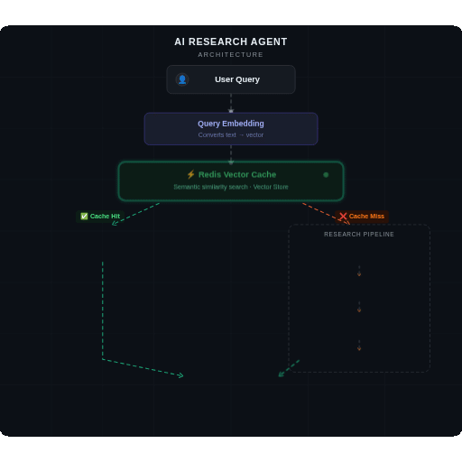

# 🔍 AI Research Agent

> An intelligent research agent that answers queries by searching the web, extracting relevant information, summarizing with an LLM — and avoiding repeated expensive calls using **semantic caching with Redis Vector Search**.

---

##  Features

-  **Semantic caching** via Redis Vector Search — no duplicate LLM calls
-  **Web search powered** research pipeline
-  **Automatic content scraping** and cleaning
-  **Groq LLM** summarization
-  **Modular tool-based** architecture
-  **Reduces latency and cost** for repeated or similar queries

---

## 🏗️ System Architecture

 

##  How It Works

### 1. User Query
The user sends a natural language query to the system.

### 2. Query Embedding
The query is converted into a vector embedding so semantic similarity can be computed.

### 3. Semantic Cache Check (Redis Vector Search)
The system first checks Redis to see if a similar query has already been processed.

| Result | Action |
|--------|--------|
|  Cache Hit | Stored response is returned **instantly** |
|  Cache Miss | System continues through the research pipeline |

### 4. Search Tool
The system searches the web to find relevant resources related to the user query.

### 5. Fetch Tool
The content from the discovered links is fetched and scraped.

### 6. Content Cleaning
Raw scraped content is cleaned and structured for the LLM.

### 7. Summarization (Groq LLM)
The cleaned content is passed to Groq LLM, which generates a concise and informative summary.

### 8. Cache Storage
The query embedding and the generated response are stored in Redis so future similar queries can be served instantly.

### 9. Final Response
The summarized answer is returned to the user.

---

##  Semantic Cache Strategy

The system uses vector similarity search to detect semantically similar queries.

**Example:**

| Query | Result |
|-------|--------|
| `Who is APJ Abdul Kalam?` |  Cache Miss → Full pipeline runs → Stored in Redis |
| `Tell me about APJ Abdul Kalam` |  Cache Hit → Instant response from Redis |

A similarity threshold ensures unrelated queries do not collide.

---

##  Tech Stack

| Category | Technology |
|----------|-----------|
| **Backend** | Node.js, TypeScript |
| **AI / LLM** | Groq LLM |
| **Embeddings** | Embedding model (vector generation) |
| **Data Layer** | Redis Stack, Redis Vector Search |
| **Tools** | Web Search Tool, Fetch Tool, Summarization Tool |

---

##  Project Structure

```
src/
 ├── agent/
 │    └── researchAgent.ts
 │
 ├── controllers/
 │    └── researchControllers.ts
 │
 ├── db/
 │    ├── cache.ts
 │    ├── createIndex.ts
 │    └── redisClient.ts
 │
 ├── llm/
 │    ├── embedding.ts
 │    └── model.ts
 │
 ├── tools/
 │    ├── searchTool.ts
 │    ├── fetchTool.ts
 │    └── summariseTool.ts
 │
 └── routes/
      └── researchRoutes.ts
```

---

##  Getting Started

### Prerequisites

- Node.js v18+
- Redis Stack running locally or via Docker
- Groq API key

### Installation

```bash
# Clone the repo
git clone https://github.com/your-username/ai-research-agent.git
cd ai-research-agent

# Install dependencies
npm install

# Set up environment variables
cp .env.example .env
# Add your GROQ_API_KEY and REDIS_URL
```

### Running the Server

```bash
npm run dev
```

---

##  Example Flow

```
Query: "Who is APJ Abdul Kalam?"

First request:
  Cache Miss → Web Search → Fetch Content → LLM Summary → Store in Redis → Response

Second similar request ("Tell me about APJ Abdul Kalam"):
  Cache Hit → Instant response from Redis ⚡
```

---

## 💡 Why Semantic Caching Matters

LLM calls are expensive and slow. Semantic caching solves this by:

-  **Reducing latency** — cached responses are instant
-  **Reducing LLM costs** — no duplicate API calls
-  **Improving scalability** — handles more queries without proportional cost growth

This architecture mirrors techniques used in modern AI search systems like Perplexity.

---

## 🔮 Future Improvements

- [ ] Streaming responses
- [ ] Better semantic cache ranking
- [ ] Multi-query retrieval
- [ ] Source ranking and filtering
- [ ] RAG integration with vector databases

---

## 👤 Author

**Aditya Raj**

---

> ⭐ If you found this project useful, consider giving it a star!